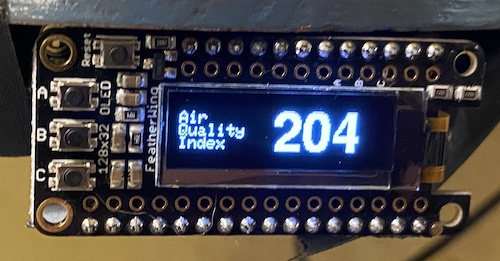

# AQThing

AQThing is an small Internet of Things (IoT) device that displays the current Air Quality Index, updated hourly.



## Prerequisites

This code is based around the following hardware:

- ESP8266 (the ESP32, but without Bluetooth). I prefer the [Adafruit Feather Huzzah](https://www.adafruit.com/product/2821) for this. It's a little more spendy than other ESP8266 packages, but includes a lot of bells and whistles, and has a nice ecosystem around it.
- An I2C 128x32 OLED display. I'm using [this OLED FeatherWing](https://www.adafruit.com/product/2900) because it mates with the Huzzah and I happened to have one kicking around the back of a drawer.

It uses the following software and libraries:

- [Arduino IDE and Toolchain](https://www.arduino.cc/en/Main/Software) — C compiler and firmware uploading.
- [Adafruit GFX library](https://github.com/adafruit/Adafruit-GFX-Library) — Graphic buffer and bitmap fonts for rendering the display.
- [Adafruit SSD1306 library](https://github.com/adafruit/Adafruit_SSD1306) — I2C and display protocol for lighting up pixels on the OLED.
- [ESP8266WiFi library](https://arduino-esp8266.readthedocs.io/en/latest/esp8266wifi/readme.html) — Wifi and HTTP.

It uses the following web service:

- [IQ Air](https://www.iqair.com) — You will need to create an account and then request a free “Community” access level API key.

## Hardware Setup

For the hardware I used, it's a matter of soldering headers onto boards, then connecting the Huzzah to the display. If you're using hardware from other vendors, the steps will likely be different.

## Software Setup

Copy `settings-example.h` to `settings.h` and edit in the specifics of your Wifi, API, and location:

- `SSID` — Your network name.
- `PASSWORD` — Your network password.
- `API_KEY` — The API key you obtained from creating an IQ Air account (see Prerequisites, above).
- `CITY`, `STATE`, `COUNTRY` — The location you'd like to retrieve air quality for. Check the API and docs for specifics and find the nearest supported city, since they do not have data for every city.

To get a list of supported cities for your state (assuming you are in the US), you can run the following `curl` command from a terminal:

```bash
curl 'http://api.airvisual.com/v2/cities?state={{STATE_NAME}}&country=USA&key={{YOUR_API_KEY}}'
```

## Links

AQThing lives at <https://github.com/BrianEnigma/AQThing>.

You can find more about the IQ Air API at <https://api-docs.iqair.com>.

## License

Copyright 2020, distributed under a [Creative Commons Attribution-NonCommercial-ShareAlike 4.0 International License](http://creativecommons.org/licenses/by-nc-sa/4.0/).

Third party libraries may have their own licensing.

You will have to agree to IQ Air's licensing and terms to obtain an API key.

